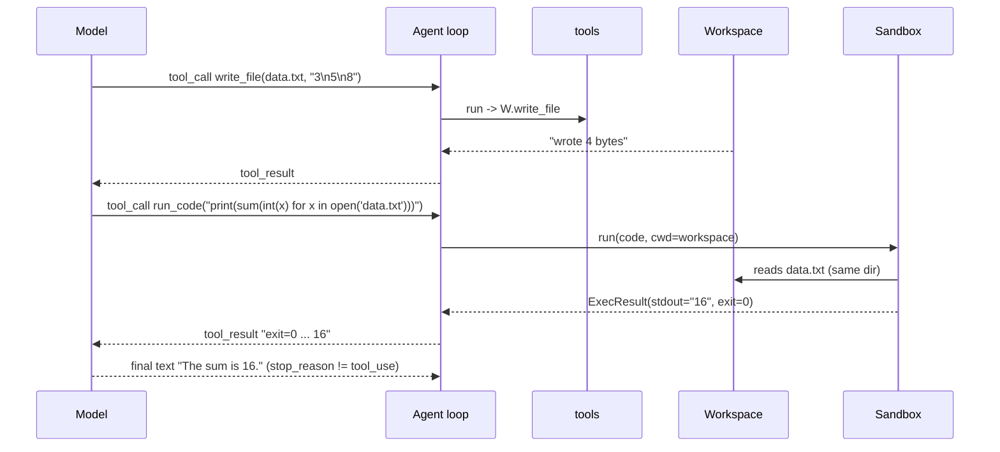

# DESIGN — Sandbox + Workspace

> Phase: **design** (MEDIUM: new module). Reads `specs/sandbox/SPEC.md`.
> Grounded in the real harness API: `agent.py` (loop + `_dispatch` + hooks), `tool.py`
> (`Tool.from_function` infers schema from type-hints + docstring), `tool.run(inputs)`.
> KB: greenfield (no ADR/PAT in repo). Next: `/03-tasks`.

## 1. Module layout (new `sandbox/` package)

```text
src/predicta_harness/sandbox/
├── __init__.py        # public API: Sandbox, LocalSandbox, BubblewrapSandbox,
│                      #   Workspace, ExecResult, SandboxError, sandbox_tools
├── types.py           # ExecResult (dataclass), SandboxError (Exception)
├── workspace.py       # Workspace — the path-traversal-safe persistent FS
├── base.py            # Sandbox (ABC) — run(code, lang, timeout) -> ExecResult
├── local.py           # LocalSandbox — subprocess, no isolation (dev/learn)
├── bubblewrap.py      # BubblewrapSandbox — bwrap jail (real isolation, Linux)
└── tools.py           # sandbox_tools(workspace, sandbox) -> list[Tool]
```

### File changes
```
CREATE src/predicta_harness/sandbox/{__init__,types,workspace,base,local,bubblewrap,tools}.py
CREATE tests/test_workspace.py
CREATE tests/test_local_sandbox.py
CREATE tests/test_bubblewrap_sandbox.py        # skipif bwrap missing
CREATE tests/test_sandbox_tools_integration.py # mock provider drives Agent (no live LLM)
CREATE tests/_mock_provider.py                 # a scripted Provider for the integration test
CREATE examples/sandbox_agent.py               # AC1 end-to-end demo (local + bwrap)
MODIFY src/predicta_harness/__init__.py        # re-export sandbox public API
MODIFY pyproject.toml                          # add [optional-dependencies] test = ["pytest"]
```

> Self-contained: **no changes to `agent.py` / `tool.py`** — the substrate plugs in purely
> through `Agent(tools=..., on_tool=..., tool_interceptor=...)`. That's the design win.

## 2. Contracts (exact signatures)

```python
# types.py
@dataclass
class ExecResult:
    stdout: str
    stderr: str
    exit_code: int
    timed_out: bool = False
    duration_ms: int = 0

class SandboxError(RuntimeError): ...   # infra failure only (e.g. bwrap missing)

# workspace.py
class Workspace:
    def __init__(self, root: str | Path) -> None         # mkdir -p root; stores resolved root
    @property
    def root(self) -> Path
    def resolve(self, path: str) -> Path                 # R1: must stay under root, else ValueError
    def read_file(self, path: str) -> str                # UTF-8; FileNotFoundError -> caught by tool
    def write_file(self, path: str, content: str) -> int # mkdir parents; returns bytes
    def list_files(self, subdir: str = ".") -> list[str] # sorted relative paths

# base.py
class Sandbox(ABC):
    def __init__(self, workspace: Workspace) -> None
    @abstractmethod
    def run(self, code: str, *, lang: str = "python", timeout: float = 30.0) -> ExecResult

# local.py
class LocalSandbox(Sandbox):     # subprocess.run([python, "-I", "-c", code], cwd=ws.root, timeout=...)
    def __init__(self, workspace, *, python: str = sys.executable) -> None

# bubblewrap.py
class BubblewrapSandbox(Sandbox):  # raises SandboxError at __init__ if shutil.which("bwrap") is None
    def __init__(self, workspace, *, python: str = "/usr/bin/python3", bwrap: str = "bwrap") -> None

# tools.py
def sandbox_tools(workspace: Workspace, sandbox: Sandbox) -> list[Tool]
```

## 3. The tool factory (how it binds to `Tool`)

`@tool` only decorates module functions; we need closures over `(workspace, sandbox)`, so
the factory defines inner functions and wraps each with `Tool.from_function` (which infers
the schema from the closure's type-hints + uses its docstring as the description):

```python
def sandbox_tools(workspace, sandbox):
    def read_file(path: str) -> str:
        "Read a UTF-8 text file from the workspace. `path` is relative to the workspace root."
        return workspace.read_file(path)

    def write_file(path: str, content: str) -> str:
        "Create/overwrite a text file in the workspace (parent dirs auto-created)."
        n = workspace.write_file(path, content)
        return f"wrote {n} bytes to {path}"

    def list_files(subdir: str = ".") -> str:
        "List files in the workspace as relative paths."
        names = workspace.list_files(subdir)
        return "\n".join(names) if names else "(empty)"

    def run_code(code: str, timeout: float = 30.0) -> str:
        "Execute Python code in the sandbox, with the workspace as the working dir. "
        "Returns the exit code, stdout and stderr. Files you wrote are visible here."
        return _format(sandbox.run(code, lang="python", timeout=timeout))

    return [Tool.from_function(f) for f in (read_file, write_file, list_files, run_code)]
```

- **Errors → tool errors, not crashes:** `Workspace` raises `ValueError`/`FileNotFoundError`;
  the harness `_dispatch` already wraps `tool.run` in try/except → the model gets the message
  and retries (R-error-cases). We don't need our own try/except in the closures.
- **`_format(ExecResult)`:** `f"exit={r.exit_code}{' (timed out)' if r.timed_out else ''}\n"
  f"--- stdout ---\n{trunc(r.stdout)}\n--- stderr ---\n{trunc(r.stderr)}"` with `trunc` at
  ~10 KB (R4).

## 4. The bubblewrap command (concrete)

`BubblewrapSandbox.run` builds this argv and runs it with a host-side `subprocess` timeout
(killing the bwrap process tears down the whole jail via `--die-with-parent`):

```text
bwrap --unshare-all --die-with-parent --new-session
      --ro-bind /usr /usr
      --ro-bind-try /bin /bin  --ro-bind-try /sbin /sbin
      --ro-bind-try /lib /lib  --ro-bind-try /lib64 /lib64
      --proc /proc  --dev /dev  --tmpfs /tmp
      --bind <workspace.root> /workspace  --chdir /workspace
      --clearenv  --setenv PATH /usr/bin:/bin  --setenv HOME /workspace
      <python> -I -c <code>
```

- `--unshare-all` ⇒ **no network** (R2), plus PID/IPC/UTS/cgroup/user namespaces.
- Only `/workspace` is `--bind` (read-write); everything else is `--ro-bind` ⇒ code can't
  touch the host FS (R1 at the OS level, on top of the harness path guard).
- `--clearenv` ⇒ no host secrets leak into the child env.
- `python` is a **system** interpreter (`/usr/bin/python3`), NOT the harness venv ⇒ the
  agent's code can't import the harness's deps (extra isolation; intended).
- Timeout: `subprocess.run(argv, timeout=timeout)`; on `TimeoutExpired` ⇒ kill ⇒
  `ExecResult(timed_out=True, exit_code=124)`.

## 5. Integration with `Agent` (the usage shape)

```python
ws = Workspace("/srv/agent-ws/alice")
sb = LocalSandbox(ws)                 # or BubblewrapSandbox(ws) on the Linux VM
agent = Agent(
    model="local/qwen", system="You are a coding teammate. Use the tools.",
    tools=sandbox_tools(ws, sb),
    on_tool=lambda n, i, o: audit.write(n, i, o),     # R7 audit (mirrors Albert's acta/)
    tool_interceptor=confirm_run_code,                # R6 optional human gate (off by default)
)
agent.run("Create data.txt with 3 numbers, then compute their sum with Python.")
```

`confirm_run_code(name, inputs)` returns `None` to let it run, or a string to block+answer
(the existing `tool_interceptor` contract in `agent.py`).

## 6. End-to-end flow (AC1)



```text
 Model        Agent loop      tools/Workspace        Sandbox
   │ write_file ──►│ ──► W.write_file ──► "wrote 4 bytes"
   │◄──── tool_result ─────────────────────────────────┘
   │ run_code  ──►│ ──────────────────────────► run(cwd=ws)
   │              │                              reads data.txt (same dir)
   │◄──── tool_result "exit=0 … 16" ◄──── ExecResult(stdout=16)
   │ final: "The sum is 16."  (stop_reason != tool_use → loop ends)
```

## 7. Risks & mitigations

| Risk | Mitigation |
|------|------------|
| `bwrap` only on Linux; absent on dev laptop/Windows | `LocalSandbox` is cross-platform; `BubblewrapSandbox` raises `SandboxError` early; tests `skipif(which('bwrap') is None)`; run the jail on `dev-instance` |
| System python under jail lacks a lib the code wants | by design (isolation). For the spike, stdlib only; document it; a future backend can bind a venv |
| `get_type_hints` on closures | works (closures carry `__annotations__`); covered by a factory unit test asserting the 4 tools' schemas |
| Output floods context | `trunc` at ~10 KB per stream (R4) |
| Path guard bypass via symlink | `resolve()` uses real-path resolution and re-checks containment (R1) |
| New dep (pytest) vs minimal-deps ethos | test-only `[optional-dependencies] test`; runtime deps stay `pydantic` only; install/run with **uv** |

## 8. Design level: MEDIUM — new self-contained module, no changes to the core loop.
