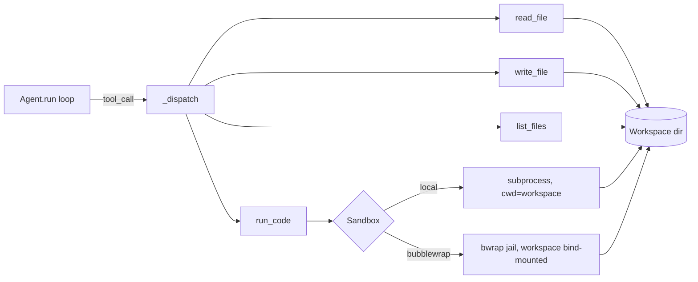

# SPEC — Sandbox + Workspace (agent code execution & persistent files)

> Phase: **specify** (Contract-First, standard). Project: `predicta-harness`.
> Date: 2026-06-22. Author: Albert + Claude. Status: draft for approval.
> Next: `/02-design` → `/03-tasks`.

## 1. User story & goal

> As a harness user, I want to give an agent a **persistent file workspace** (its
> "codebase") and the ability to **execute code** on it, so the agent can create files,
> edit them, run code that reads them, and feed the result back into its reasoning —
> **first with no isolation (`local`, to learn the loop), then jailed (`bubblewrap`)**.

The multi-step ReAct loop already exists (`agent.py`: `while steps < max_steps`, tool
dispatch, result feedback, hooks `on_tool` / `tool_interceptor`). This spec adds the
**execution + filesystem substrate** and the **tools** that expose it to an `Agent`.

## 2. Scope

**In:**
- A `Sandbox` ABC: `run(code, lang, timeout) -> ExecResult`. Implementations `LocalSandbox`
  (subprocess, no isolation) and `BubblewrapSandbox` (namespaces, no root, real isolation).
- A `Workspace`: a persistent directory with `read_file` / `write_file` / `list_files`,
  guarded against path traversal.
- A tool factory `sandbox_tools(workspace, sandbox) -> list[Tool]` returning
  `[read_file, write_file, list_files, run_code]`, ready for `Agent(tools=...)`.
- Security: bubblewrap `--unshare-all` (no network), read-only system binds, the workspace
  the only writable mount, non-root, wall-clock timeout; optional **human confirmation**
  for `run_code` via the existing `tool_interceptor`; **audit** via the existing `on_tool`.

**Out (deferred):** managed backends (Daytona/Modal/E2B), network access inside the sandbox,
multi-agent shared workspaces, language runtimes beyond Python, ReAct loop changes.

## 3. Architecture (where it plugs in)



```text
  Agent.run loop ──tool_call──► _dispatch
                                  ├── read_file ─┐
                                  ├── write_file ┼──► Workspace dir  (persistent)
                                  ├── list_files ┘        ▲
                                  └── run_code ──► Sandbox │
                                                   ├ local:      subprocess (cwd=ws) ┘
                                                   └ bubblewrap: bwrap jail, ws bind-mounted
```

**Key separation:** the file tools are **workspace-scoped FS ops** done by the harness
(path-traversal-safe); only `run_code` crosses the **isolation boundary** (the `Sandbox`).
The `Workspace` is the persistence; the `Sandbox` is the jail. Same workspace dir for both.

## 4. Interface contracts

### 4.1 ExecResult
```
ExecResult { stdout: str, stderr: str, exit_code: int, timed_out: bool, duration_ms: int }
```

### 4.2 Sandbox (ABC)
```
Sandbox.run(code: str, *, lang: str = "python", timeout: float = 30.0) -> ExecResult
  - Executes `code` with CWD = the workspace dir.
  - lang: "python" only in v1 (others -> ValueError).
  - On timeout: kill, return ExecResult(timed_out=True, exit_code=124).
  - MUST NOT raise on non-zero exit / stderr — that's normal program output the agent reads.
  - Raises SandboxError only on infra failure (e.g. bwrap binary missing).
```
- `LocalSandbox(workspace)` — `subprocess.run([python, "-c", code], cwd=ws, timeout=...)`.
  **No isolation** (can read/write host FS, open sockets). For trusted/dev use only.
- `BubblewrapSandbox(workspace, python=...)` — wraps the same in `bwrap`: `--unshare-all`
  (no network/PID/IPC), `--ro-bind` the interpreter + system libs, `--bind <ws> /workspace`
  `--chdir /workspace`, non-root, `--die-with-parent`; timeout enforced by the harness.

### 4.3 Workspace
```
Workspace(root: Path)                       # created if absent; this is the persistence
  read_file(path: str) -> str               # path is RELATIVE to root
  write_file(path: str, content: str) -> int  # returns bytes written; creates parent dirs
  list_files(subdir: str = ".") -> list[str]  # relative paths, sorted
  resolve(path: str) -> Path                # internal: traversal-safe absolute path
```

### 4.4 Tools (what the agent sees) — via `sandbox_tools(workspace, sandbox)`
| Tool | Input | Output (string to model) | Error → message |
|------|-------|--------------------------|-----------------|
| `read_file` | `{path: str}` | file contents | not found / outside workspace → clear error |
| `write_file` | `{path: str, content: str}` | `"wrote N bytes to <path>"` | outside workspace → error |
| `list_files` | `{subdir?: str}` | newline list of relative paths | bad subdir → error |
| `run_code` | `{code: str, timeout?: float}` | `"exit=<c>\n--stdout--\n…\n--stderr--\n…"` (truncated) | infra failure → error |

## 5. Domain rules & constraints

- **R1 — Workspace jail (path traversal):** every file op resolves the path under `root`
  (`(root / path).resolve()` must be within `root.resolve()`); `..`, absolute paths, and
  symlink escapes are rejected. This holds for BOTH backends (file tools are harness-side).
- **R2 — No network in `bubblewrap`:** `--unshare-all` removes the net namespace; the agent
  can't exfiltrate via the sandbox. (`local` has no such guarantee — documented, dev-only.)
- **R3 — Timeout always enforced** (default 30s, capped, e.g. ≤120s); a runaway program is
  killed and reported as `timed_out`.
- **R4 — Output bounded:** stdout/stderr truncated (e.g. 10 KB each) before going to the
  model, so a noisy program can't blow the context/token budget.
- **R5 — Persistence:** the workspace dir survives across `run()` calls and process restarts
  (it's a real directory) — that's the agent's "codebase". Files written by `write_file` are
  visible to `run_code` and vice-versa (same dir).
- **R6 — Human gate (opt-in):** `run_code` can be routed through the existing
  `tool_interceptor` to require confirmation before executing (off by default in the spike).
- **R7 — Audit:** every tool call is observable via the existing `on_tool(name, input, output)`.
- **R8 — Minimal deps:** stdlib only (`subprocess`, `pathlib`, `shutil`); `bubblewrap` is an
  OS binary discovered at runtime (`shutil.which("bwrap")`), not a Python dependency.

## 6. Error cases & recovery

| Case | Behaviour | Recovery |
|------|-----------|----------|
| `read_file` path missing | tool returns `"Error: file not found: <path>"` (is_error) | model reads the error, lists files, retries |
| path escapes workspace | tool returns `"Error: path outside workspace"` (is_error) | model corrects the path |
| `run_code` times out | `ExecResult(timed_out=True, exit_code=124)`; tool output says so | model shortens/fixes the code |
| code raises / non-zero exit | NORMAL: stderr + exit code returned as output (NOT a tool error) | model debugs from the traceback |
| `bwrap` not installed | `BubblewrapSandbox` construction raises `SandboxError` with install hint | fall back to `LocalSandbox` or install bubblewrap |
| output too large | truncated with a `…[truncated]` marker | model asks for a narrower slice |

## 7. Acceptance criteria

- [ ] **AC1 (loop, local):** an `Agent` with `sandbox_tools(ws, LocalSandbox(ws))` completes:
  "create `data.txt` with 3 numbers, then run Python that reads it and prints the sum" —
  observed: `write_file` → `run_code` reads the file → final answer states the sum.
- [ ] **AC2 (persistence):** a file written in one `run()` is readable by `read_file`/`run_code`
  in a later `run()` (same workspace), proving the codebase persists.
- [ ] **AC3 (jail, bubblewrap):** the SAME scenario passes with `BubblewrapSandbox`, AND a
  negative probe confirms isolation: code that tries to open a network socket fails, and code
  that tries to read a host path outside the workspace cannot.
- [ ] **AC4 (traversal):** `read_file("../../etc/passwd")` / absolute paths are rejected.
- [ ] **AC5 (timeout):** `run_code` of `while True: pass` returns `timed_out` within the limit,
  loop continues.
- [ ] **AC6 (deps):** `pip install -e .` unchanged; no new Python deps; `bwrap` discovered at
  runtime; `LocalSandbox` works with zero OS setup.

## 8. Edge cases

- Empty workspace / first run → `list_files` returns `[]`, no error.
- `write_file` to a nested path (`a/b/c.txt`) → parent dirs created (inside the jail).
- Non-UTF-8 file read → decode errors handled (return a clear message, don't crash the loop).
- `run_code` with `lang != "python"` → `ValueError` surfaced as a tool error.
- Concurrent runs on the same workspace → out of scope (single-agent spike; note for later).

## 9. Validation strategy

Deterministic, no live LLM required for the substrate:
- **Unit:** `Workspace` traversal/round-trip; `LocalSandbox.run` stdout/exit/timeout;
  `BubblewrapSandbox.run` (skipped if `bwrap` absent) incl. no-network + no-host-FS probes.
- **Integration (mock provider):** drive `Agent` with a scripted provider that emits the
  write→run tool calls, assert the loop reaches the sum (AC1) without a real model.
- **Smoke (real model, optional):** the AC1 scenario end-to-end on the configured provider.
