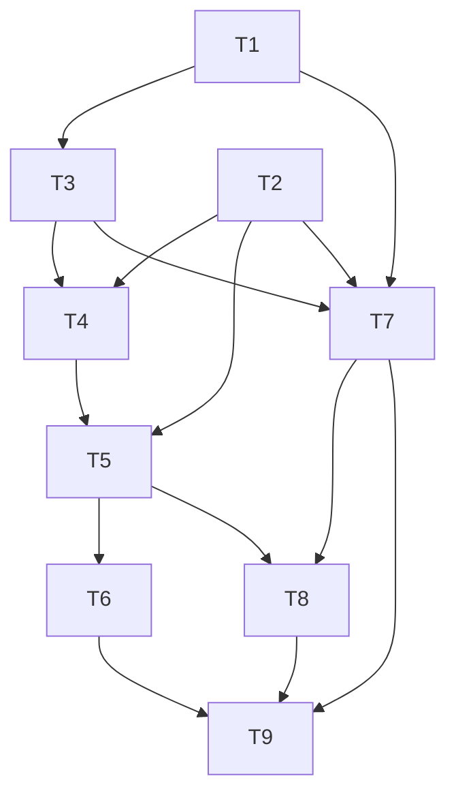

# TASKS — Sandbox + Workspace spike

> Phase: **tasks**. Reads `SPEC.md` + `DESIGN.md`. TDD (RED → GREEN → REFACTOR).
> Stack: Python stdlib-only runtime; `pytest` test-only; install/run with **uv**.
> Mirrored in the session task list (TaskCreate #1–#9). Next: `/04-implement` per task.

## Ordered tasks

| # | Task | Files (create unless noted) | Test (RED first) | Depends |
|---|------|------------------------------|------------------|---------|
| T1 | sandbox types | `sandbox/types.py` | — (used by consumers) | — |
| T2 | Workspace + traversal guard | `sandbox/workspace.py` | `tests/test_workspace.py` | — |
| T3 | Sandbox ABC | `sandbox/base.py` | via backends | T1 |
| T4 | LocalSandbox | `sandbox/local.py` | `tests/test_local_sandbox.py` | T1,T2,T3 |
| T5 | `sandbox_tools` factory | `sandbox/tools.py` | `tests/test_sandbox_tools.py` | T2,T4 |
| T6 | Agent integration (mock provider) | `tests/_mock_provider.py` | `tests/test_sandbox_tools_integration.py` | T5 |
| T7 | BubblewrapSandbox + isolation probes | `sandbox/bubblewrap.py` | `tests/test_bubblewrap_sandbox.py` (skipif no bwrap) | T1,T2,T3 |
| T8 | example demo (AC1) | `examples/sandbox_agent.py` | runs end-to-end | T5 (+T7) |
| T9 | wire public API + test dep | `sandbox/__init__.py`, MODIFY `predicta_harness/__init__.py`, `pyproject.toml` | full `uv run pytest` green | all |

## Dependency graph & critical path



```text
T1 ─┬─► T3 ─► T4 ─► T5 ─► T6 ─┐
T2 ─┴────────┘     └─► T8 ◄─┐ ├─► T9
T1,T2,T3 ─► T7 ────────────┴─┘
                (T7 runs in PARALLEL with T4–T6: different files)
```

- **Critical path:** T1 → T3 → T4 → T5 → T6 → T9 (the runnable `local` loop end-to-end).
- **Parallelizable:** T7 (bubblewrap) is independent of T4–T6 — different file; can run alongside.
- **Acceptance mapping:** AC1/AC2 ← T5+T6+T8 (local) · AC3 ← T7 · AC4 ← T2 · AC5 ← T4/T7 · AC6 ← T9.

## Notes for `/04-implement`

- Run on a Linux box for T7 (`dev-instance` has `bwrap`); T1–T6 + T8 (local) run anywhere, incl. Windows.
- Each task: write the failing test, minimal GREEN, then refactor; keep didactic docstrings
  (the harness style: each module opens with a `"""why this exists"""`).
- No runtime deps added (pydantic stays the only one); `bwrap` is discovered via `shutil.which`.
- The whole spike touches **zero** lines of `agent.py` / `tool.py` — it plugs in via `Agent(...)`.
